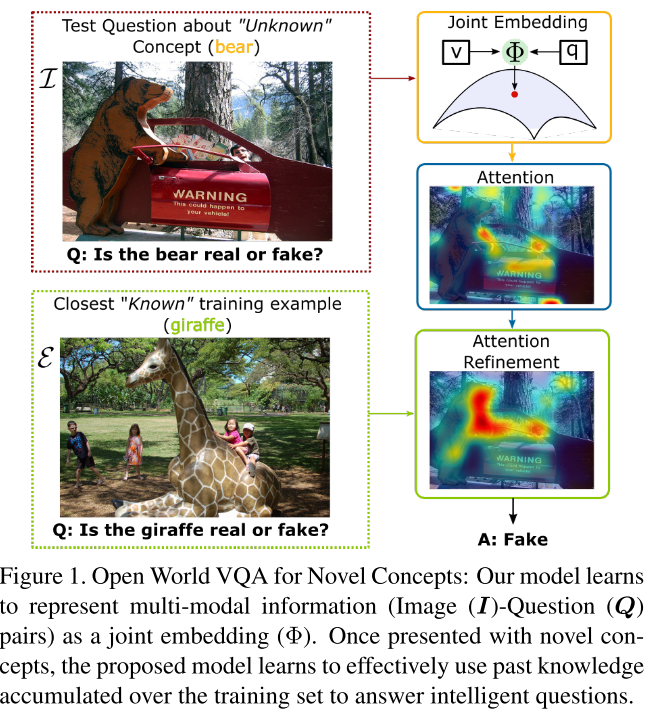
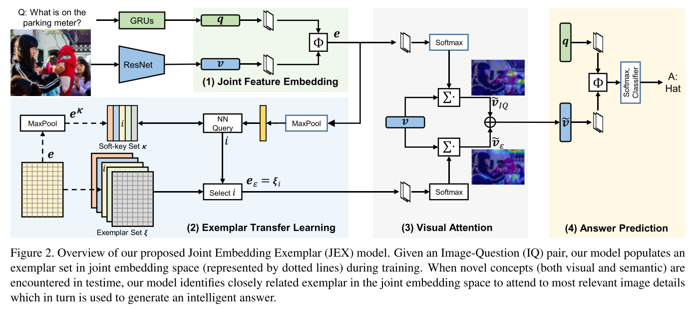
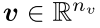
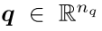
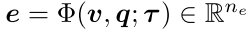
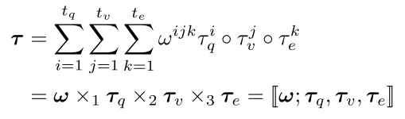
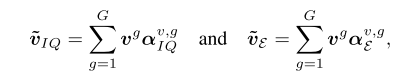
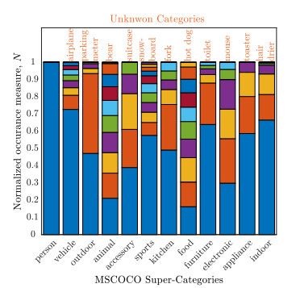
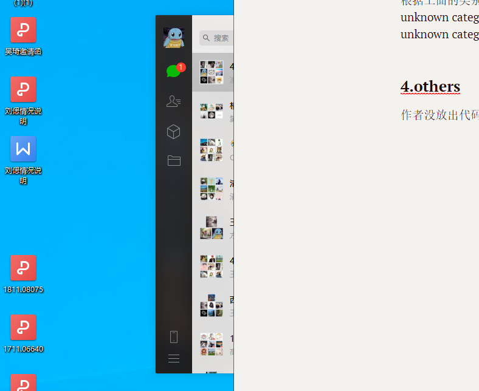

## **From Known to the Unknown: Transferring Knowledge to Answer Questions about Novel Visual and Semantic Concepts**

### **1.解决的问题和主要贡献**

> **这篇论文解决的是关于novel concept的open world VQA问题**，**现有的VQA模型在‘known’ visual content上面可以取得很好的效果，但是一个实际应用的VQA系统应该能够很好的处理novel concept，这篇文章提出了一种方法，来提高模型在open world上面的表现。主要贡献其实就一个：**

- 论文相比于ICCV 2017 https://arxiv.org/abs/1705.06676 的改进之处在于加入了exemplar transfer learning，通过与unknown concept相似的known concept来对visual content进行refine，来提升模型对于unknown concept的效果

  

### **2.方法**

模型整体框架

#### 2.1 Joint Feature Embedding

VQA模型需要根据visual feature和question feature产生一个joint embedding

为了减少模型参数数量，作者在这里采用tucker decomposition来做，tucker分解相当于高维的PCA，起到对tensor的降维作用，关于tucker decomposition，可以参考https://arxiv.org/abs/1705.06676

#### 2.2 Exemplar based Learning Transfer

如果在测试时遇到unknown concept，模型需要根据训练时的known concept来进行transfer learning，在这里作者通过一个generic attention function A来做

整个模型的训练是一个two-stage的过程：第一个阶段只训练joint embedding部分，然后把embedding Tensor存储起来。第二个阶段对整个模型进行end to end的训练，Exemplar Transfer Learning部分的作用是通过nearest neighbour search找到e中和当前的embedding vector最相关的vector，然后做一个attention来对visual content的attention map进行refine

#### 2.3 Visual Attention

two level of attention in the entire network，joint embedding e用来对visual feature进行一个attention，第二个是根据exemplar e，find the most similar exemplar进行一个类似的attention，以达到对visual content的refine

### **3. 数据集的划分**

VQA数据集中得image 来自于MSCOCO，作者对coco中的object种类进行known/unknown的划分

#### Known/UnKnown Object Split

在每一个super category中，choose the rarest category as unknown

#### Image-Question-Answer Split

根据上面的类别划分，对VQAv1和VQAv2进行重新划分，首先先将图片中没unknown category的triplet划分入training set，然后剔除问题或答案中与unknown category相关的triplet

### **4.others**

作者没放出代码也无第三方实现

